# Qiskit Machine Learning Project

## Neural Network Classifier & Regressor

**Table of Contents**

[TOC]


### Instalación de Paquetes
Se realiza la instalación de los paquetes requeridos para la ejecución del proyecto.
`pip install 'qiskit[machine-learning]`
`pip install matplotlib`
`pip install IPython`
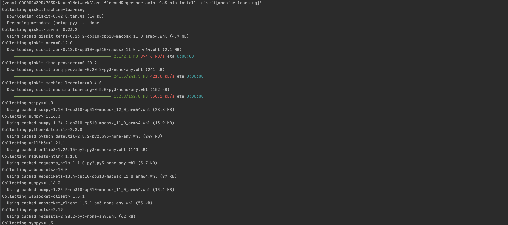
> Instalación de Librerías.

### Importar Librerías
Se importan las librerías y componentes necesarios para los modelos de Clasificación y Regresión.
```python
import matplotlib.pyplot as plt
import numpy as np
from IPython.display import clear_output
from qiskit import QuantumCircuit
from qiskit.algorithms.optimizers import COBYLA, L_BFGS_B
from qiskit.circuit import Parameter
from qiskit.circuit.library import RealAmplitudes, ZZFeatureMap
from qiskit.utils import algorithm_globals

from qiskit_machine_learning.algorithms.classifiers import NeuralNetworkClassifier, VQC
from qiskit_machine_learning.algorithms.regressors import NeuralNetworkRegressor, VQR
from qiskit_machine_learning.neural_networks import SamplerQNN, EstimatorQNN

```

### Modelo de Clasificación
Implementa un clasificador básico de redes neuronales cuánticas. Se implementan métodos compatibles con Scikit-Learn para clasificar y extender ClassifierMixin. 

Se realiza la preparación de un conjunto de datos preliminar para entrenar las redes neuronales.
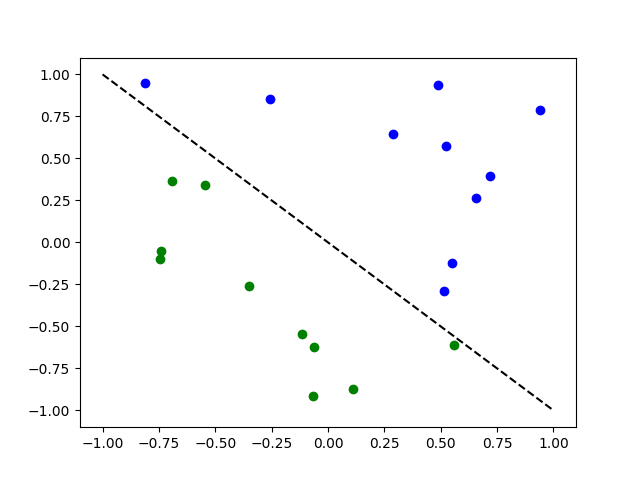
> Preparación del DataSet.

#### Clasificación con EstimatorQNN
EstimatorQNN una red neuronal que toma un circuito cuántico parametrizado con parámetros designados para datos de entrada y/o pesos, observables opcionales y genera sus valores esperados.

Inicialmente se espera que devuelva una salida unidimensional
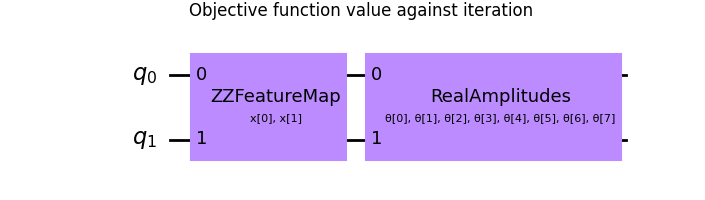

Una vez se ha crea la red neuronal cuántica, se crea la función callback_graph esta llamará para cada iteración del optimizador y se le pasarán dos parámetros: los pesos actuales y el valor de la función objetivo en esos pesos.

Se realiza el entrenamiento del modelo y las predicciones correspondientes, una vez se ha realizado el entrenamiento se pueden explorar los pesos de la red neuronal.
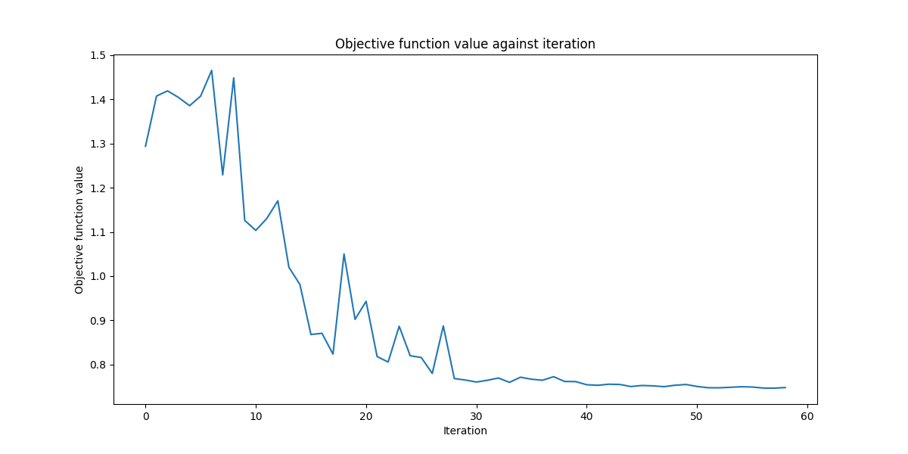
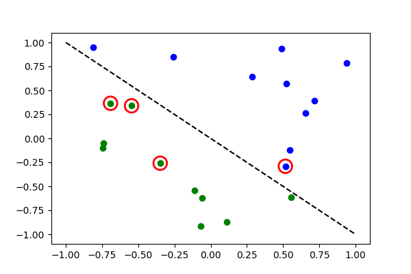
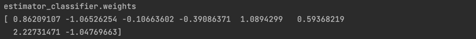

#### Clasificación con SamplerQNN
SamplerQNN es una red neuronal que toma un circuito cuántico parametrizado con parámetros designados para datos de entrada y/o pesos y traduce las cuasi-probabilidades estimadas por el Sampler primitivo en clases predichas.
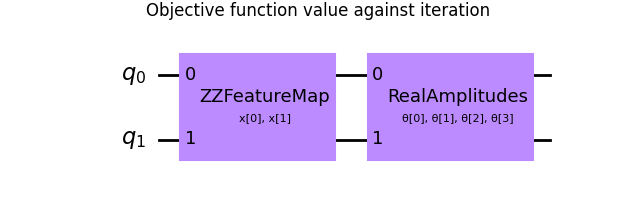

Los pasos realizados para la clasificación son los mismos para EstimatorQNN.
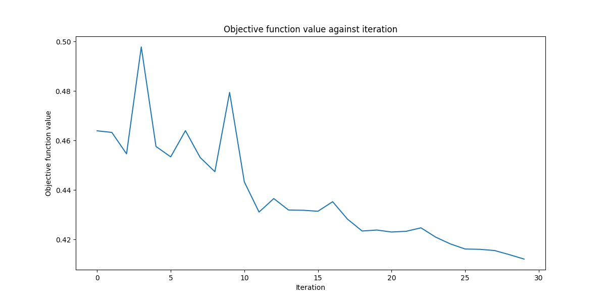

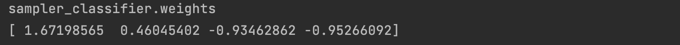

#### Clasificación con VQC (Variational Quantum Classifier)
El VQC es una variante de una Red Neuronal de Clasificación con un SamplerQNN, se aplica un mapeo de paridad desde la cadena de bits hasta la clasificación, lo que da como resultado un vector de probabilidad, que se interpreta como un resultado codificado en caliente.
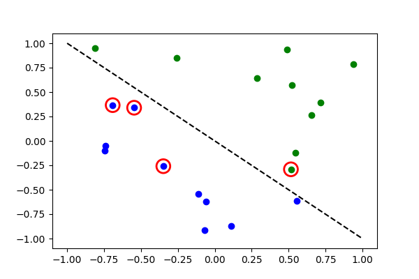
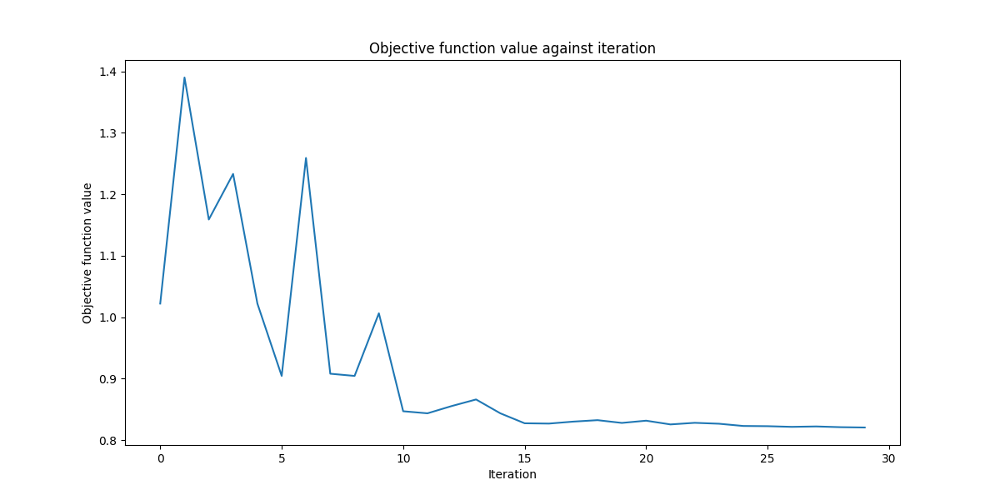